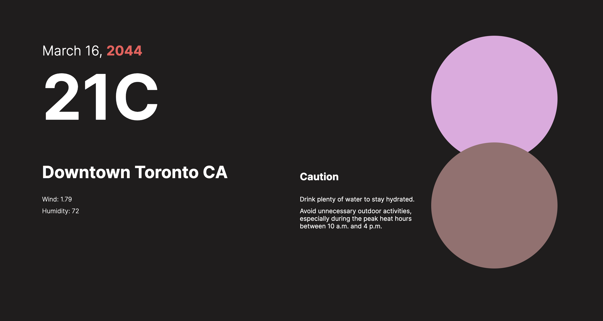

### 🌤️ Weather Predictor App 🌈

### Welcome to the Weather Predictor App! 
This app collects current weather data from Open Weather based on your location anywhere in the world. It then manipulates this data to make assumptions about how the weather might look like for that location in 20 years.

### How it Works 🛠️

1. **Current Weather Data**: The app uses your device's location or inputted location to fetch current weather data from Open Weather.

2. **Data Manipulation**: After collecting the current weather information, the app applies various algorithms and data analysis techniques to predict how the weather might change for that location over the next 20 years.

3. **Assumption Generation**: Based on the manipulated data, the app generates assumptions about the weather conditions in 20 years. These assumptions are displayed to the user for fun and entertainment purposes only.

### Usage 🚀

1. **Input Location**: Enter your location in the app or allow the app to access your device's location.

2. **View Predictions**: After fetching the current weather data, view the assumptions about the weather conditions for your location in 20 years.

3. **Enjoy**: Have fun exploring the weather predictions! Remember, these predictions are for entertainment purposes only and may not reflect reality.

### Screenshots 📸

### Website 🔗

Check out the Weather Predictor App [here](https://weather-predictability.netlify.app/).

### Disclaimer ⚠️

This app is developed for entertainment purposes only. The weather predictions generated by this app are not accurate and do not reflect reality. Please do not rely on this app for making any real-life decisions related to weather conditions.
